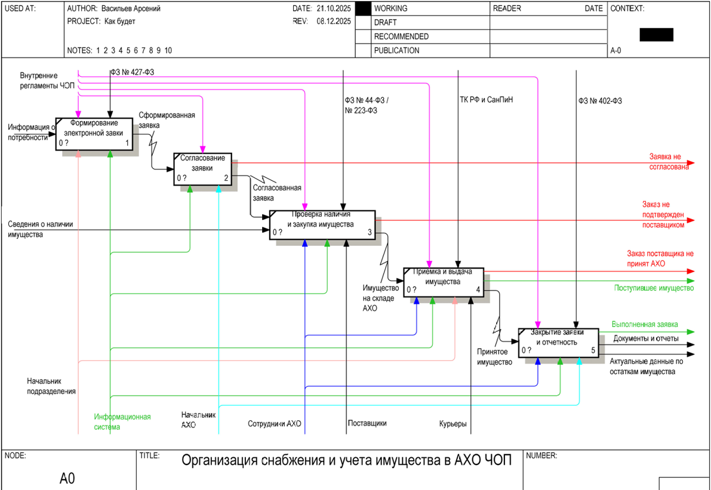
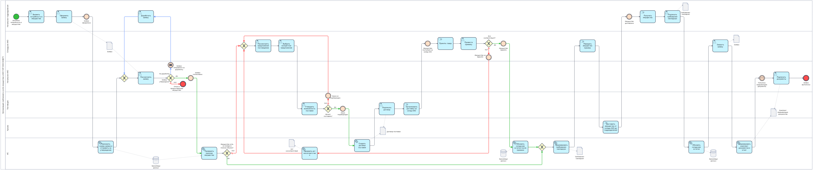
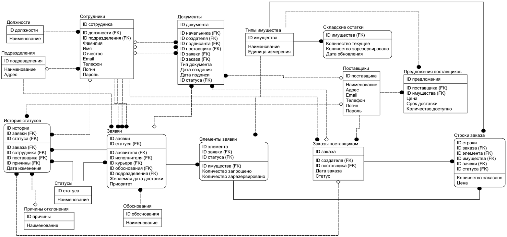
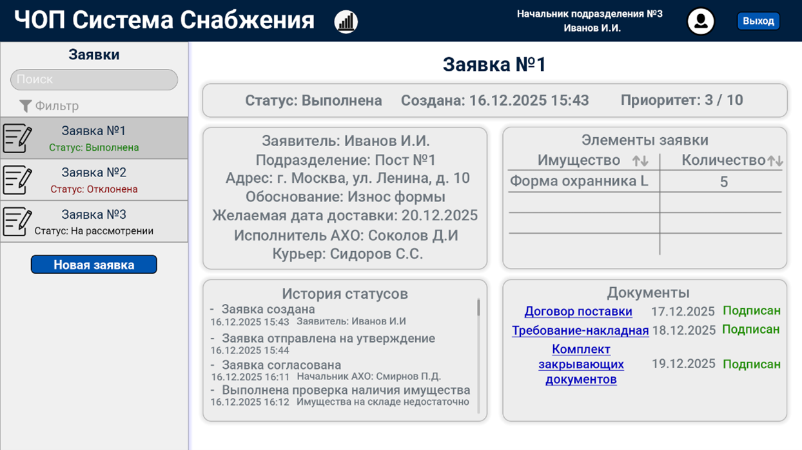
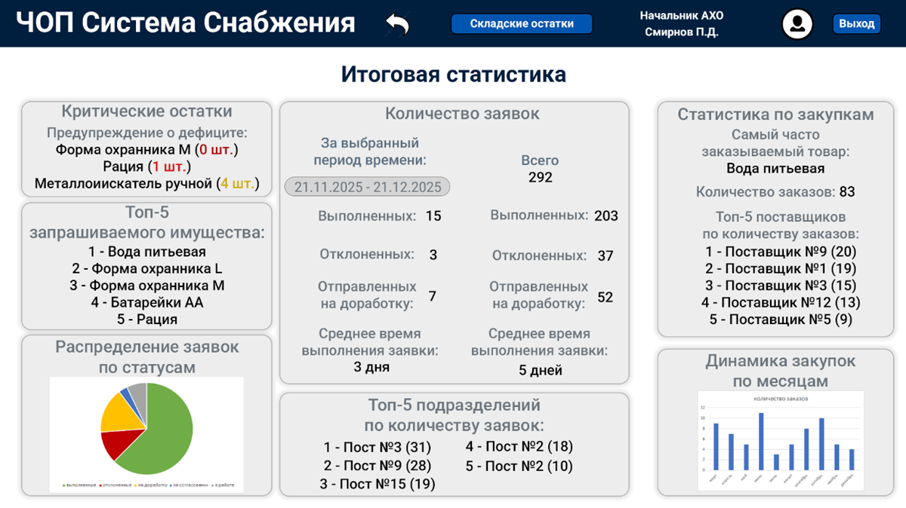

# Проектирование архитектуры БД и моделирование бизнес-процессов (BPMN / ER-моделирование)

[Скачать полную проектную документацию (PDF)](ais_cho_property_accounting.pdf)

## Бизнес-задача
Проведение полного цикла системного и бизнес-анализа для автоматизации процессов снабжения и учета имущества в административно-хозяйственном отделе (АХО) частного охранного предприятия (ЧОП). Цель проекта - устранить рутинный ручной труд, ликвидировать риски дублирования данных и спроектировать верхнеуровневую архитектуру новой автоматизированной информационной системы (АИС).

## Стек технологий
* **Бизнес-моделирование:** BPMN, IDEF0 (построение моделей процессов AS-IS и TO-BE).
* **Проектирование БД:** ER-моделирование (IDEF1X), концептуальное и логическое проектирование реляционных баз данных.
* **Инструменты и ПО:** BPwin, ERwin, Adobe Photoshop.

## Ключевые этапы работы
1. **Анализ предметной области:** Декомпозиция текущих бизнес-процессов снабжения, выявление "узких мест" ручного бумажного документооборота.
2. **Проектирование логики TO-BE:** Разработка оптимизированных моделей процессов в нотациях BPwin и BPMN, где ключевые контрольные и учетные функции переданы информационной системе.
3. **Архитектура данных:** Спроектирована логическая структура реляционной базы данных для хранения информации о заявках, остатках на складах, поставщиках и сопутствующем документообороте. 
4. **Проектирование интерфейсов:** Создание ролевых прототипов пользовательских интерфейсов (UI/UX) для различных участников процесса.

## Фрагменты спроектированной архитектуры

### 1. Функциональное моделирование процессов (BPwin / TO-BE)
Верхнеуровневая декомпозиция целевой логики работы системы:

### 2. Описание логики взаимодействия участников (BPMN / TO-BE)
Детальная карта последовательности выполнения операций и шлюзов принятия решений:

### 3. Логическая структура базы данных (ER-диграмма)
Спроектированная инфологическая модель данных, нормализованная для исключения избыточности:

### 4. Прототипы пользовательского интерфейса (UI/UX)
Макеты экранов системы, разработанные для ключевых ролей пользователей:
* **Главный рабочий экран сотрудника АХО:**

* **Аналитическая панель итоговой статистики для руководства:**

